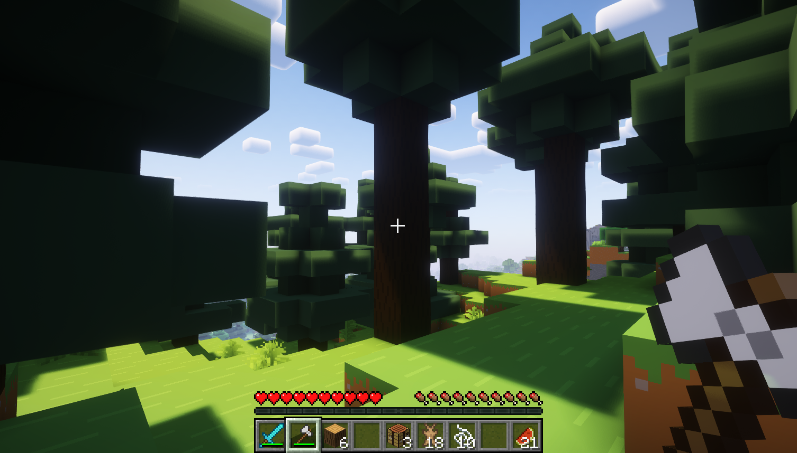
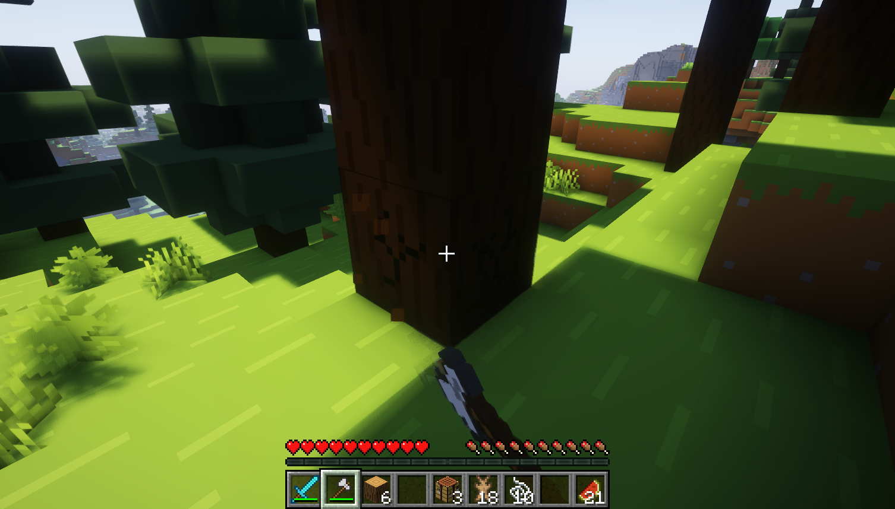
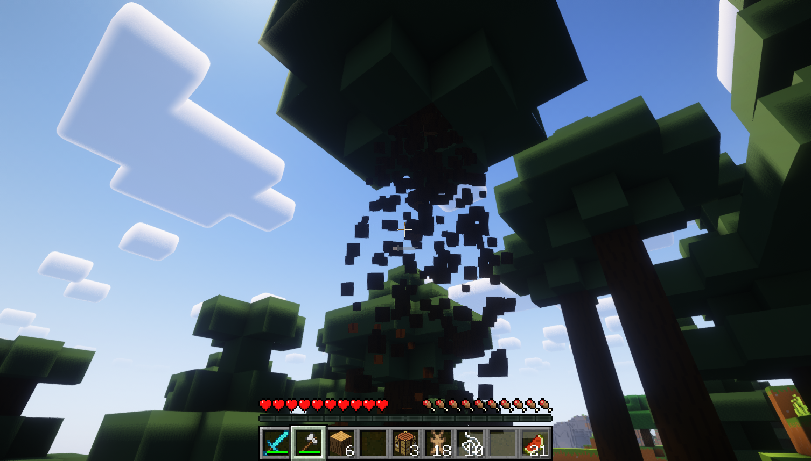

# Timber Data Pack

> Break trees with ease.

A simple data pack for Minecraft to break the whole trunk of a tree.

**Disclaimer**: This also applies to player placed logs. To avoid breaking your house, sneak when breaking logs to disable timber.

## How it works

### 1. Locate a tree

### 2. Break the bottom log of a tree

### 3. Watch the whole tree break

## License

No license is provided.

Since this is a public repository, you may however view and fork the code according to GitHub's [Terms of Service](https://help.github.com/articles/github-terms-of-service).
Permission for usage that exceeds those terms is not granted.

> Copyright (c) 2023 David Maier
>
> All rights reserved.
>
> THE SOFTWARE IS PROVIDED “AS IS”, WITHOUT WARRANTY OF ANY KIND, EXPRESS OR IMPLIED, INCLUDING BUT NOT LIMITED TO THE WARRANTIES OF MERCHANTABILITY, FITNESS FOR A PARTICULAR PURPOSE AND NONINFRINGEMENT. IN NO EVENT SHALL THE AUTHORS OR COPYRIGHT HOLDERS BE LIABLE FOR ANY CLAIM, DAMAGES OR OTHER LIABILITY, WHETHER IN AN ACTION OF CONTRACT, TORT OR OTHERWISE, ARISING FROM, OUT OF OR IN CONNECTION WITH THE SOFTWARE OR THE USE OR OTHER DEALINGS IN THE SOFTWARE.
